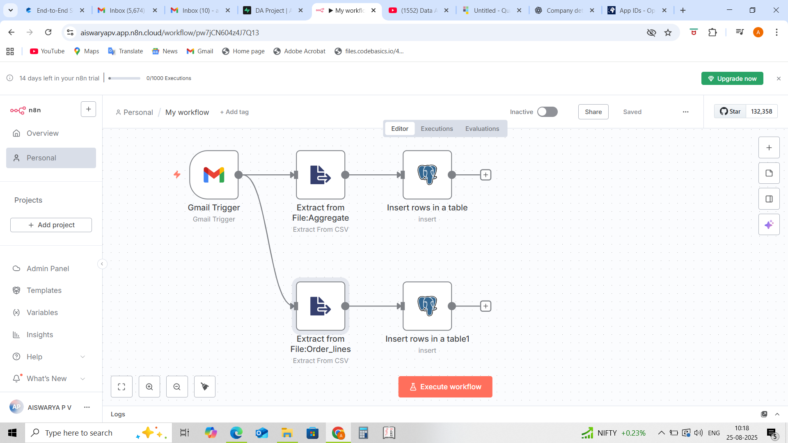
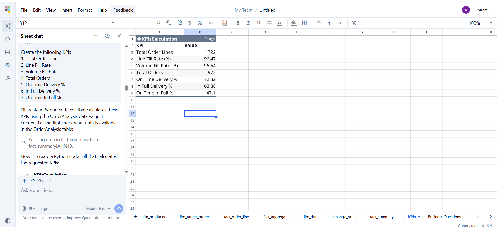

# End-to-End Supply Chain Analytics Project (AI Tools: Quadratic & n8n)

## 📌 Project Overview
This project focuses on solving **inventory management challenges** in a supply chain using **AI-powered analytics and automation tools**.  
I implemented a workflow that automates data ingestion and enables real-time analytics to monitor supply chain KPIs.

---

## 🏗️ Tech Architecture
**Spreadsheet (via Email) → n8n (automation) → PostgreSQL (hosted on Supabase) → Quadratic (AI-powered analysis)**

- **n8n** → Automated ingestion of incoming order data from emails into PostgreSQL.  
- **Supabase** → Cloud-hosted PostgreSQL database.  
- **Quadratic** → Pulled data from PostgreSQL, performed analysis, and generated KPIs & insights.  
- **Validation** → Quadratic output cross-verified with Supabase data.  

---

## 📊 Supply Chain KPIs Tracked
1. Total Order Lines  
2. Line Fill Rate  
3. Volume Fill Rate  
4. Total Orders  
5. On-Time Delivery %  
6. In-Full Delivery %  
7. On-Time In-Full %  

Example KPI sheet created in Quadratic:  

---

## 🔎 Business Insights Generated
Using **Quadratic** analysis, I identified:  
- Monthly on-time performance by city  
- Top 5 customers by order value & their OTIF %, IF %, OT %  
- Top 5 customers in India by order value & their OTIF %, IF %, OT %  

Example Output:  

---

## 🤖 AI Prompting in Quadratic
I made extensive use of **prompts** in Quadratic for creating tables, generating KPIs, and analyzing customer performance.  
Full details of the prompts are available in [`prompts_used.md`](./prompts_used.md).

---

## ⚙️ Tools & Tech Stack
- **n8n** → Workflow automation  
- **Quadratic** → AI-powered spreadsheet + SQL integration  
- **PostgreSQL (Supabase)** → Cloud database  
- **Python (via Quadratic)** → KPI calculations  

---

## 🚀 Key Learnings
- Gained **hands-on experience in Supply Chain Analytics** by working with industry KPIs.  
- Learned how to integrate **automation (n8n)** with **data analysis (Quadratic)**.  
- Understood how to host and manage databases using **Supabase**.  
- Improved skills in **AI prompting, data validation, and pipeline building**.  

---

## 📂 Repository Structure
├── n8n_workflows/
│ └── My_workflow.json
├── screenshots/
│ ├── n8n-workflow.png
│ ├── KPI_sheet.png
│ └── Top 5 customers by order value.png
├── prompts_used.md
└── README.md

---

## ⚠️ Note
The original dataset used in this project is part of a guided learning program by [Codebasics](https://codebasics.io/).  
👉 Due to licensing restrictions, the dataset is **not shared** here.  
All code, workflows, and insights are my own implementation.
